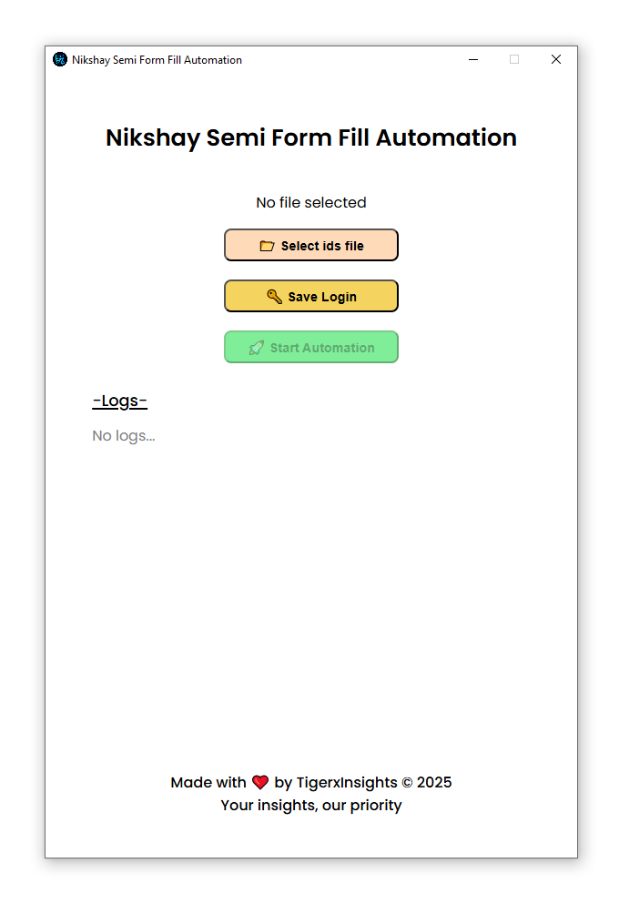

---

# Nikshay Semi Form Fill Automation

An Electron + Playwright based desktop application that streamlines repetitive workflows on portals like Nikshay.
This app automates form filling, manages login sessions, and handles ID queues with a clean desktop UI — no terminal needed!

## Features

- Desktop UI for easy interaction.
- Login persistence using auth.json (one-time login).
- ID Queue System:
  - Reads IDs from ids.txt.
  - Moves processed IDs → ids_done.txt.
- Form Auto-Fill with common fields pre-populated.
- Manual Review Pause before submission.
- Auto-Continue after each submission.
- Multi-Tab Handling (opens each ID in a new full-screen tab).

## Tech Stack

- Electron – Cross-platform desktop framework
- Playwright – Browser automation
- TypeScript / JavaScript – Logic & scripting
- File System (fs) – ID queue management

## Project Structure

```
nikshay-semi-form-fill-automation/
├── assets/          # Icons, logos
├── src/
│   ├── main/        # Electron main process
│   ├── renderer/    # UI
│   └── automation/  # Playwright scripts│         
├── auth.json        # Saved login state
├── package.json
└── README.md
```

## ScreenShots



## Setup & Usage

- Clone this repository.
- cd semi-form-fill-automation
- Install dependencies.
- Run in development mode,
- Build desktop app (Windows).

## Workflow

- Open the app → Select ids.txt file → Start Automation.
- Script opens the first ID in a full-screen tab.
- Form auto-fills → You review/edit → Submit.
- After submission → ID moves to ids_done.txt.
- Next ID starts automatically.

## Deployment

- App can be packaged into .exe, .dmg, or .AppImage.
- No server required — runs entirely on your desktop.

## License

This project is licensed under the MIT License - see the [LICENSE](LICENSE) file for details.

## Author

Made with ❤️ by Tiger

---